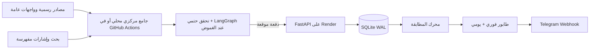

# NabaaAgent — نبأ

[](https://github.com/K7Ax/NabaaAgent/actions/workflows/quality.yml)

## Capstone Submission

| | |
|---|---|
| **Student** | Khalid Al-Zahem |
| **Programme** | SDAIA Academy — Agentic AI Systems, Aug 2026 |
| **Declared track** | **Track A** |
| **Academy** | [SDAIA Academy on GitHub](https://github.com/SDAIAAcademy) |
| **Capstone notebook** | [`capstone.ipynb`](capstone.ipynb) — every rubric section demonstrated with captured output |
| **Section write-up** | [`docs/capstone-writeup.md`](docs/capstone-writeup.md) |
| **Rubric map** | [`docs/rubric-map.md`](docs/rubric-map.md) — each rubric section → file, test, notebook cell |

This project was completed under the **SDAIA Academy — Agentic AI Systems** training
programme (cohort: August 2026).

### What this project is (English summary)

**Nabaa (نبأ)** is an Arabic Telegram platform that centrally discovers student
opportunities in Saudi Arabia — bootcamps, scholarships, internships, graduate
programmes, hackathons and events — then *verifies* each one (re-opening the
application page and requiring first-party evidence) before deterministically
matching it against each student's profile. It starts with King Saud University
and supports other universities plus remote-friendly opportunities.

The agentic pipeline is built with the **LangGraph Functional API**
(`@task` / `@entrypoint`): an LLM supervisor classifies each request with
structured output and routes it to agentic discovery (a tool-calling ReAct agent),
a retrieval-augmented knowledge answerer, or long-term memory updates. Verification
runs as an **Evaluator-Optimizer** loop, and anything ambiguous pauses for human
approval via `interrupt()`.

### Running the capstone notebook

```powershell
python -m venv .venv
.venv\Scripts\python -m pip install -e ".[dev,capstone]"
Copy-Item .env.example .env    # then fill in your keys
.venv\Scripts\python -m jupyter lab capstone.ipynb
```

Restart the kernel and run all cells top to bottom. Cells needing live API keys are
marked and skip gracefully when a key is absent.

نبأ منصة Telegram عربية تكتشف فرص الطلاب مركزيًا، تتحقق من رابط التقديم والأدلة،
ثم تطابق الفرصة برمجيًا مع ملف كل طالب. تبدأ المنصة بجامعة الملك سعود، وتدعم
طلاب الجامعات الأخرى والفرص المتاحة في السعودية أو عن بُعد.

## ما الذي تغير في الإصدار 0.2

- البحث مركزي مرة واحدة بدل تكراره لكل طالب.
- دعم Telegram Webhook مع بقاء Long Polling للتطوير المحلي.
- Workflow مركزي يدعم الفحص السريع والعميق وإعادة التحقق؛ الجدولة السحابية تبقى
  متوقفة حتى تتوفر قاعدة دائمة و`NABAA_API_URL` و`INTERNAL_API_SECRET`.
- سجل مصادر، دورات فحص، إشارات خام، نسخ فرص، أدلة، صحة مصادر وميزانيات استخدام.
- 12 فئة: التدريب الصيفي والتعاوني، برامج الخريجين، الوظائف الجزئية والمبتدئة،
  الدورات، المعسكرات، المنح، المسابقات، الهاكاثونات، الفعاليات والتطوع.
- تصنيف KSU بإصدار مستقل، مع اختيار الجامعة والكلية والتخصص بالأزرار.
- اختيار أنواع متعددة من الفرص وأسئلة أهلية تدريجية بالأزرار.
- مطابقة حتمية لا تعتمد على LLM ودرجة مفهومة من 100.
- إشعارات فورية للفرص الأقوى وملخص يومي للبقية.
- إعادة فتح صفحة التقديم قبل الإرسال؛ الصفحة المغلقة أو غير المتاحة لا تُرسل.
- Tavily وGroq وOpenRouter للاكتشاف والتحليل فقط، وليس لاتخاذ قرار الأهلية.
- حد Tavily شهري مركزي يفشل بأمان قبل تجاوز الرصيد المجاني.
- HMAC مع مدة صلاحية خمس دقائق لكل واجهة تشغيل داخلية.
- ترحيل إضافي يحافظ على الطلاب والمحـفوظات والتسليمات من الإصدار السابق.

## البنية



لا يُعد منشور LinkedIn أو X ولا موقع تجميعي دليلًا كافيًا. يمكن استخدامه كإشارة
للعثور على صفحة تقديم رسمية فقط. الفرصة غير المكتملة تبقى مخفية.

## التشغيل محليًا

يتطلب Python 3.11 أو أحدث:

```powershell
python -m venv .venv
.venv\Scripts\python -m pip install -e ".[dev]"
Copy-Item .env.example .env
```

ضع الأسرار في `.env` محليًا ولا ترسلها في المحادثات أو Git. يمكن تشغيل الواجهة:

```powershell
.venv\Scripts\python -m uvicorn opportunity_sentinel.api:app --reload
```

يظل `opportunity-bot` متاحًا للتطوير المحلي باستخدام Long Polling، لكنه لا يشغل
بحثًا دوريًا لكل طالب. بيئة الإنتاج تستخدم Webhook فقط.

## نشر مجاني دائم للبيانات: Render + Turso

المسار المجاني الموصى به للمشروع الطلابي هو خدمة Webhook واحدة من `Dockerfile` على
Render، وقاعدة Turso البعيدة المتوافقة مع SQLite. خدمة Render المجانية تنام بعد
15 دقيقة من الخمول، لذلك يرسل Workflow خفيف طلب `/health` كل 10 دقائق. تبقى
البيانات خارج القرص المؤقت للخدمة، ولا يستخدم نبض الصحة Tavily أو LLM.

أنشئ قاعدة Turso ثم Render Web Service من المستودع، واختر Docker وFree، وأضف:

```dotenv
APP_ENV=production
DATABASE_URL=libsql://YOUR-DATABASE.turso.io
TURSO_AUTH_TOKEN=...
DATA_DB_PATH=/tmp/opportunity_sentinel.db
CHECKPOINT_DB_PATH=/tmp/opportunity_checkpoints.sqlite
PUBLIC_BASE_URL=https://YOUR-SERVICE.onrender.com
TELEGRAM_BOT_TOKEN=...
TELEGRAM_ADMIN_CHAT_ID=...
TELEGRAM_WEBHOOK_SECRET=RANDOM_LONG_VALUE
INTERNAL_API_SECRET=ANOTHER_RANDOM_LONG_VALUE
GROQ_API_KEY=...
OPENROUTER_API_KEY=...
TAVILY_API_KEY=...
TAVILY_MONTHLY_CREDIT_LIMIT=900
```

عند بدء الخدمة يُسجّل Webhook تلقائيًا. يعرض `/readiness` حالة المكونات وأعداد
السجلات دون كشف أي سر.

## أسرار GitHub Actions

أضف إلى Repository Secrets:

- `NABAA_API_URL`: رابط خدمة Render.
- `INTERNAL_API_SECRET`: نفس القيمة الموجودة في Render.
- `GROQ_API_KEY`, `OPENROUTER_API_KEY`, `TAVILY_API_KEY`.

Workflow المسمى `Central Opportunity Discovery` يعمل تلقائيًا فقط بعد وجود
`NABAA_API_URL` و`INTERNAL_API_SECRET`، وينفذ:

- `fast`: موصلات طويق (API ثم القناة الرسمية عند حجب Cloudflare)، مهارات المستقبل،
  كتالوج مسك وأكاديمية منشآت، أخبار وبوابة خريجي KSU، الأكاديمية المالية، ولوحات الشركات الرسمية
  Ashby/Lever/Greenhouse مع صحة مستقلة لكل شركة؛ بلا Tavily أو LLM، كل 30 دقيقة.
- `deep`: سبعة استعلامات في كل دورة ضمن مصفوفة دوارة تغطي 12 فئة خلال اليوم،
  مع إشارات LinkedIn وX كل 8 ساعات، باستخدام Tavily Basic حتى 20 نتيجة.
- `revalidate`: انتهاء المواعيد وإعادة فتح الروابط يوميًا.
- `deliver`: توزيع طابور المطابقات بعد كل تشغيل ناجح.

كل فرصة مرتبطة بموصلها في قاعدة البيانات. إذا أكمل المصدر الرسمي دورة ناجحة ولم
تعد الفرصة ضمن كتالوجه، تُسحب من النتائج ويُلغى إرسالها المعلّق تلقائيًا.

يمكن تشغيل أي وضع يدويًا من GitHub دون تغيير الكود. الجدولة تفحص المصادر الرسمية
كل 30 دقيقة، وتشغّل البحث العميق عند 00:17 و08:17 و16:17 UTC، وإعادة التحقق
اليومية بعد 00:47 UTC. إذا كانت أسرار الإنتاج ناقصة تتوقف الدورة بأمان قبل البحث.
Workflow `Production Keepalive` لا يفعل شيئًا حتى يُضبط `NABAA_API_URL`، ثم يوقظ
الخدمة فقط؛ هذه استضافة مجانية best-effort وليست اتفاقية توافر مدفوعة.

## قياس التغطية

```powershell
.venv\Scripts\python scripts\coverage_report.py
```

يفصل التقرير بين المصادر الفعلية والإشارات والمصادر المخطط لها، ويعرض توزيع
الفرص والسجلات القديمة. لا يدّعي Recall من عدد المخزون؛ لا تُحسب النسبة إلا بعد
ملء `benchmarks/gold_opportunities.json` بمراجعة مستقلة للمصادر الرسمية.
يوجد كذلك Workflow أسبوعي باسم `Production Coverage Audit`: يرسل المرجع المستقل
إلى واجهة الإنتاج الموقعة، ويقيس الاستدعاء الكلي ولكل مصدر، ويعرض المصادر التي
تعذر تدقيقها بدل اعتبارها مصادر بلا فرص. الهدف 90%، والمرجع الأقدم من ثمانية أيام
يُوسم بأنه قديم حتى لا تتحول نتيجة تاريخية إلى ادعاء دائم.

## ضمان الجودة

```powershell
.venv\Scripts\python -m ruff check src tests scripts
.venv\Scripts\python -m pytest --cov=opportunity_sentinel --cov-fail-under=70
.venv\Scripts\python scripts\capstone_demo.py
```

الاختبارات تغطي الترحيل القديم، التوثيق، منع التكرار، المطابقة الواسعة والضيقة،
الأهلية التدريجية، HMAC، حدود Tavily، LangGraph، الأمن، Telegram وواجهات الخدمة.

## قواعد النشر غير القابلة للتجاوز

1. رابط تقديم رسمي قابل للفتح.
2. دليل رسمي على الجهة والموقع والأهلية.
3. موعد مستقبلي أو دليل صريح على أن التسجيل مفتوح.
4. الدورة التي توصف بالمجانية تحتاج دليلًا على عدم وجود رسوم.
5. الشرط الإلزامي المجهول ينتج سؤالًا للطالب، لا افتراضًا.
6. فشل LLM أو Tavily لا يخفض مستوى الأدلة المطلوب.
7. الفرصة المغلقة أو غير القابلة لإعادة التحقق لا تُرسل.

## حدود صريحة

لا توجد وسيلة قانونية أو تقنية تضمن اكتشاف كل إعلان في الإنترنت. نبأ يقيس تغطية
قائمة مصادر معلنة ويستخدم البحث لسد الفجوات. Render Free ومزودو النماذج المجانية
لا يقدمون ضمان توفر؛ عند وصول الاستخدام إلى الحد يتوقف البحث العميق بأمان، بينما
تبقى البيانات وقواعد التوثيق دون تخفيض.

راجع [معمارية الإنتاج](docs/production-architecture.md)،
[إعداد Telegram](docs/telegram-setup.md)، و[سياسة الأمن](docs/security.md).
