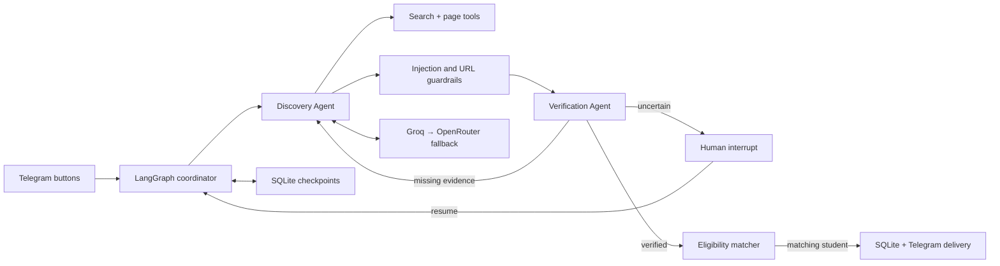

# NabaaAgent — Opportunity Sentinel

[](https://github.com/K7Ax/NabaaAgent/actions/workflows/quality.yml)

An evidence-first AI agent that discovers technical student opportunities in Riyadh,
checks whether they are still open and suitable for each student, and delivers only
verified results through a button-driven Telegram bot.

The central safety rule is simple: an LLM may discover and extract claims, but it cannot
publish an opportunity by itself. Deterministic Python policy, field-level source
evidence, eligibility matching, and human review control publication.

## What is implemented

- A real LangGraph `StateGraph` with nine nodes, conditional routing, batch collection,
  and a bounded ReAct-style search loop.
- Two distinct agents: Discovery and independent Verification, coordinated through typed
  shared state.
- Live web search and page retrieval with URL validation and private-network/SSRF blocking.
- Optional Tavily advanced search for courses, internships, and CO-OP opportunities, including
  ranked extracted content, date filtering, credit telemetry, and fallback to DDGS.
- A first-party Tuwaiq connector reads up to 100 academy listings and fetches detailed
  structured records for current registration state, deadlines, cost, location,
  requirements, and application links. It runs alongside outside-source discovery.
- Structured LLM extraction and independent review through Groq, with automatic
  OpenRouter fallback on rate limits or provider failure.
- Prompt-injection detection, Pydantic output validation, evidence requirements,
  expiry/location checks, and deterministic student eligibility rules.
- Durable SQLite LangGraph checkpoints and a real `interrupt` / `Command(resume=...)`
  human-review flow that survives process restarts.
- A fully button-driven Arabic Telegram experience: onboarding, search, profile, saved
  opportunities, application links, and administrator approval.
- Persistent student, opportunity, saved-item, delivery, and deduplication records.
- Each search can deliver up to five distinct verified opportunities; scheduled discovery
  and alerts also process unseen matches in batches.
- Structured JSON logs, health/readiness endpoints, Docker image, Docker Compose services,
  automated tests, coverage output, and a reproducible capstone evidence script.

## Quick start on Windows

Requirements: Python 3.11 or newer, a Telegram bot token, and at least one free LLM API
key from Groq or OpenRouter. Using both enables provider fallback.

```powershell
python -m venv .venv
.venv\Scripts\python -m pip install -e ".[dev]"
Copy-Item .env.example .env
```

Open `.env` locally and fill these values. Never paste secrets into chat or commit them:

```dotenv
TELEGRAM_BOT_TOKEN=your_botfather_token
TELEGRAM_ADMIN_CHAT_ID=your_numeric_telegram_id
GROQ_API_KEY=your_groq_key
OPENROUTER_API_KEY=your_openrouter_key
TAVILY_API_KEY=your_optional_tavily_key
```

Then run:

```powershell
.venv\Scripts\opportunity-bot.exe
```

Open the bot in Telegram, press **Start**, and complete the button-based onboarding.
Detailed credential and admin setup is in
[`docs/telegram-setup.md`](docs/telegram-setup.md).

## Verification before a demo

```powershell
.venv\Scripts\python -m ruff check .
.venv\Scripts\python -m pytest
.venv\Scripts\python scripts\capstone_demo.py
.venv\Scripts\python scripts\live_smoke_test.py
.venv\Scripts\python scripts\live_workflow_test.py
```

The deterministic demo proves the successful path, a blocked indirect prompt-injection
attack, the bounded re-search loop, an actual human interrupt, and resumption from the
same SQLite checkpoint after rebuilding the graph. Evidence is written to `artifacts/`.
The live smoke test checks Telegram, the administrator chat, each configured LLM provider,
and live search without writing API keys to its evidence file.
The same deterministic quality gate runs on every GitHub push without requiring secrets:
Ruff, all tests, at least 70% line coverage, and the executed capstone proof paths.

Start the service artifact separately if needed:

```powershell
.venv\Scripts\python -m uvicorn opportunity_sentinel.api:app --reload
```

- Health: `http://localhost:8000/health`
- Readiness: `http://localhost:8000/readiness`

## Docker

After creating `.env`:

```powershell
docker compose up --build
```

Compose runs the API and Telegram bot as separate services sharing a persistent SQLite
volume. The container runs as a non-root user. The API is exposed on port 8000.

## Architecture



See [`docs/architecture.md`](docs/architecture.md),
[`docs/security.md`](docs/security.md), and
[`docs/evaluation.md`](docs/evaluation.md) for the engineering rationale and proof map.
The exact 100-point mapping and GitHub submission status are in
[`docs/rubric-audit.md`](docs/rubric-audit.md).

## Scope and honest limitations

- Initial scope is technical students and Riyadh or online opportunities.
- Search-engine coverage is not mathematically complete; no web system can guarantee that
  every opportunity on the internet is indexed. The design instead optimizes publication
  precision: uncertain or incomplete items are withheld or sent to human review.
- Official Saudi government, education, and organization domains receive the strongest
  automatic trust. Other domains require stronger evidence or human approval.
- Free provider quotas and model availability are controlled by Groq/OpenRouter and may
  change; fallback prevents one provider failure from stopping the workflow when both keys
  are configured.

## Repository map

- `src/opportunity_sentinel/graph.py` — workflow nodes, edges, loop, interrupt, checkpoint.
- `src/opportunity_sentinel/agents.py` — Discovery and Verification agents.
- `src/opportunity_sentinel/tools.py` — live and deterministic research tools.
- `src/opportunity_sentinel/llm.py` — structured provider router and fallback.
- `src/opportunity_sentinel/telegram_bot.py` — Arabic button UI and notifications.
- `src/opportunity_sentinel/repository.py` — application persistence and deduplication.
- `tests/` — graph, security, API, LLM fallback, storage, and UI tests.
- `scripts/capstone_demo.py` — reproducible executed evidence.

Built for the **Advanced Agentic AI Systems Engineering** capstone, August 2026 cohort,
delivered through SDAIA Academy. See
[SDAIA Academy on GitHub](https://github.com/SDAIAAcademy).
