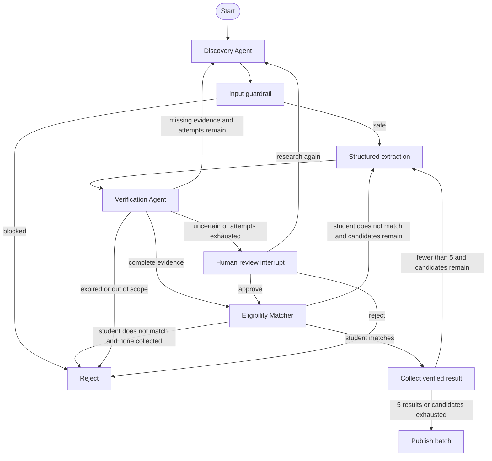

# Opportunity Sentinel architecture

## Decision principle

LLMs and agents may discover, interpret, and propose facts. Publication is controlled by
validated evidence and deterministic policy rules. Web content is always treated as
untrusted data, never as instructions.

## Graph

## Agent responsibilities

- **Discovery Agent:** Runs the bounded ReAct loop, invokes search/open tools, and extracts
  a typed candidate from untrusted sources.
- **Verification Agent:** Independently examines field-level evidence and returns a
  structured report with status, score, missing fields, conflicts, and reasons.
- **LangGraph coordinator:** Owns routing, bounded retries, shared state, checkpointing,
  and the human approval interrupt.

## Tool adapters

`WebResearchTools` performs live search, checks URLs against private-network/SSRF risks,
downloads source pages, and returns structured observations with latency and metadata.
For Tuwaiq programs it reads the academy's expanded first-party listing API. When Cloudflare
blocks server-side API traffic, it reads recent explicit registration posts from Tuwaiq's
official public channel; indexed official pages are a final fail-closed fallback. Deterministic
connectors also cover the Misk and Monsha'at Academy catalogues and current KSU news
opportunities. Unknown locations remain `unknown` rather than being guessed as Riyadh or remote.
For sources without a first-party connector, optional Tavily advanced search supplies
ranked extracted content from outside sources and records credit usage/request IDs. DDGS and safe page opening
remain the fallback, so Tavily is not a single point of failure.

The ReAct trace stores auditable `decision`, `action`, and `observation` summaries without
persisting private chain-of-thought. Discovery sends a structured candidate message to
Verification, which returns a structured verification message to the LangGraph coordinator.
`InMemoryResearchTools` implements the same interface for repeatable security and
evaluation runs. The discovery agent uses Groq first and falls back to OpenRouter when a
provider is unavailable or rate limited.

## Persistence and human review

The compiled graph uses a SQLite checkpointer. Every run has a stable `thread_id`. When an
uncertain opportunity reaches the approval node, LangGraph persists the state and pauses.
The process can later resume with `Command(resume=...)` using the same `thread_id`.
Authoritative connector inventory is stored separately from opportunity payloads. A successful
source crawl reconciles its owned URLs and expires removed records; failed crawls never delete
inventory.

## Security baseline

- Detect indirect prompt-injection patterns in retrieved pages.
- Do not extract or publish blocked pages.
- Validate candidates and verification reports with Pydantic.
- Bound research attempts to prevent uncontrolled loops and token consumption.
- Keep provider and Telegram secrets in environment variables excluded by `.gitignore`.

## Delivery and application state

The Telegram adapter identifies users by their Telegram account ID. Onboarding, search,
profile editing, saving, applying, and human-review decisions use inline buttons. A
separate SQLite repository stores student profiles, verified opportunities, saved items,
and delivery records. URL-derived identifiers suppress duplicate notifications. A
scheduled loop repeats discovery for registered students and sends only unseen matches.
