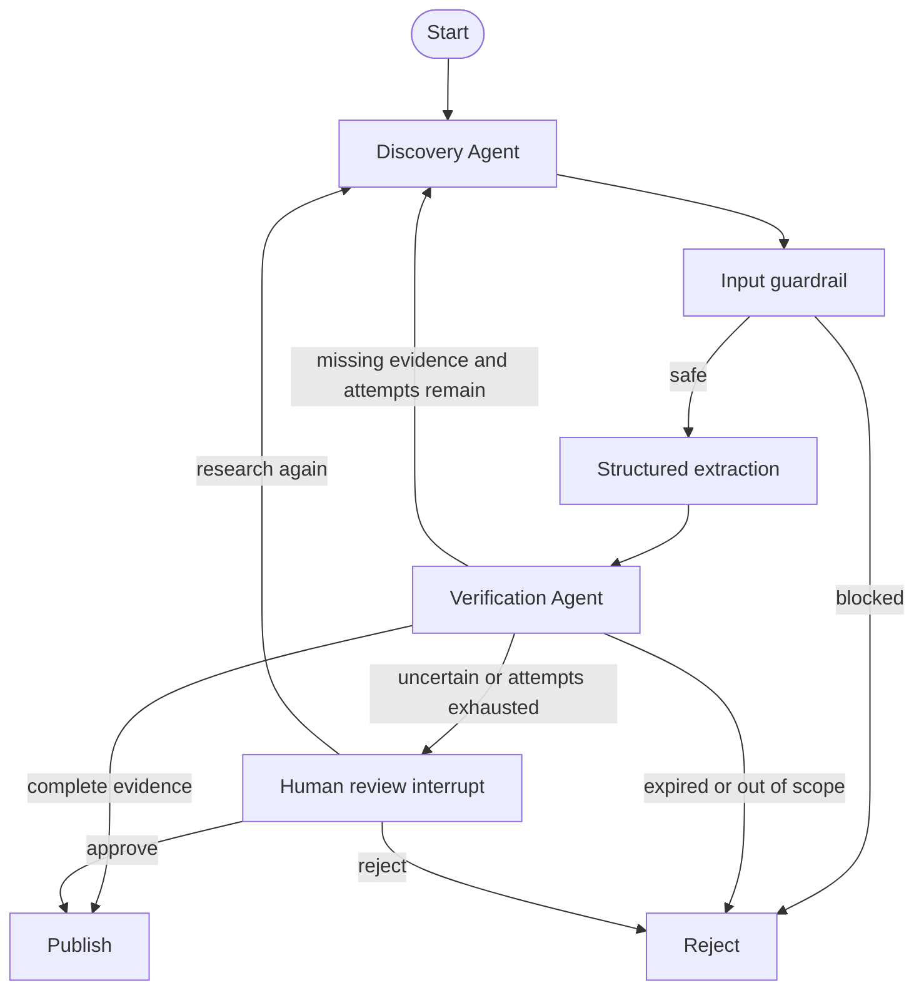

# Opportunity Sentinel architecture

## Decision principle

LLMs and agents may discover, interpret, and propose facts. Publication is controlled by
validated evidence and deterministic policy rules. Web content is always treated as
untrusted data, never as instructions.

## Graph

## Agent responsibilities

- **Discovery Agent:** Runs the bounded ReAct loop, invokes search/open tools, and extracts
  a typed candidate from untrusted sources.
- **Verification Agent:** Independently examines field-level evidence and returns a
  structured report with status, score, missing fields, conflicts, and reasons.
- **LangGraph coordinator:** Owns routing, bounded retries, shared state, checkpointing,
  and the human approval interrupt.

## Current tools

`InMemoryResearchTools` is the deterministic baseline used for repeatable development,
security demonstrations, and evaluation. Its interface is intentionally identical to the
future live search adapter: `search_web` and `open_page` both return structured tool
observations including success, latency, and metadata.

## Persistence and human review

The compiled graph uses a SQLite checkpointer. Every run has a stable `thread_id`. When an
uncertain opportunity reaches the approval node, LangGraph persists the state and pauses.
The process can later resume with `Command(resume=...)` using the same `thread_id`.

## Security baseline

- Detect indirect prompt-injection patterns in retrieved pages.
- Do not extract or publish blocked pages.
- Validate candidates and verification reports with Pydantic.
- Bound research attempts to prevent uncontrolled loops and token consumption.
- Keep provider and Telegram secrets in environment variables excluded by `.gitignore`.

## Planned adapters

The next milestones add live search, Groq/OpenRouter structured extraction, Telegram
inline keyboards, persistent opportunity/user storage, richer traces, and evaluation
datasets without changing the graph's public state contract.
